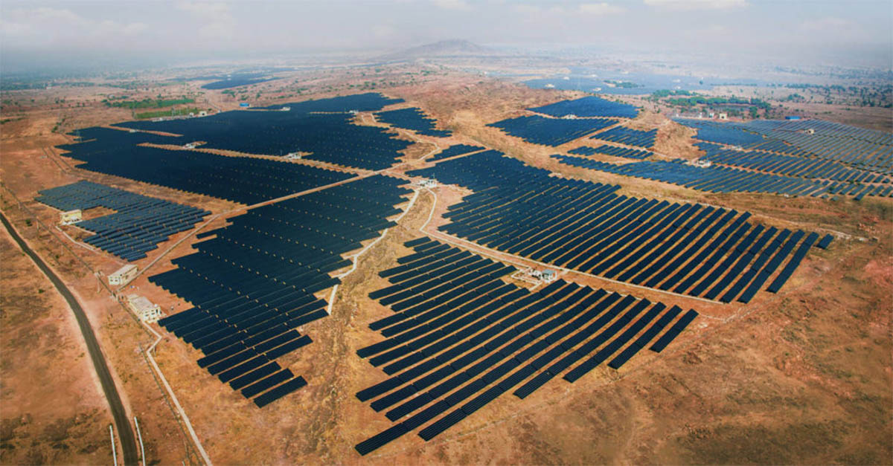
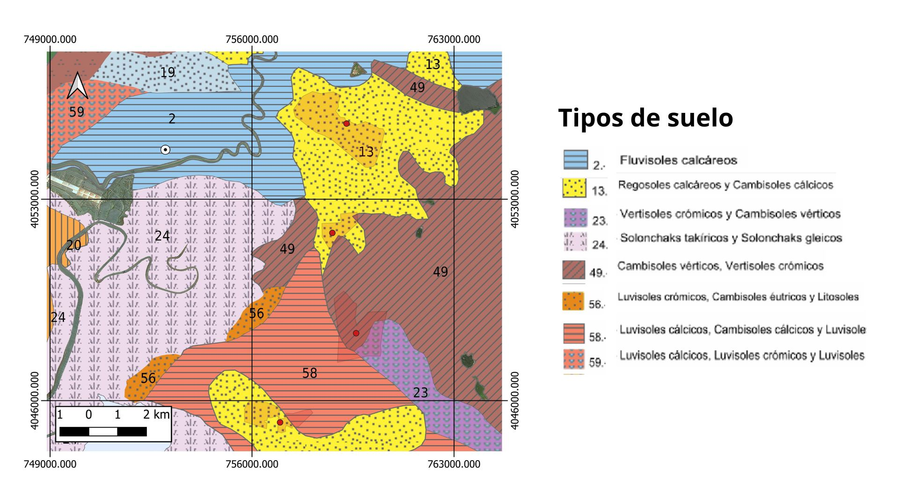
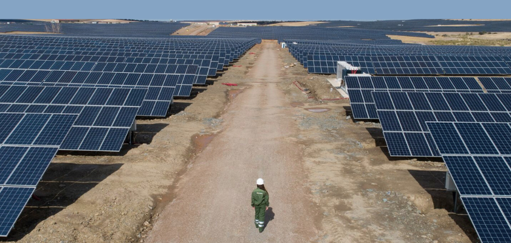

# Introducción

Este informe presenta la evaluación de la calidad de los suelos ocupados por cuatro plantas solares fotovoltaicas (**PFV**) situadas en la provincia de **Cádiz**. Todas ellas son clasificadas como *mega-centrales solares* al superar los 10 MW de potencia.

El objetivo es determinar la **capacidad de uso del suelo** siguiendo el sistema de evaluación de la **FAO**, tal como se recomienda en la *Estrategia Energética de Andalucía 2030*. 




# Material y métodos

## Zonas de Estudio

Las cuatro centrales analizadas son: **Puerto Real 110**, **Las Quinientas**, **Miramundo** y **Cartuja**. 

Estas se encuentran en la provincia de Cádiz, próximas a espacios protegidos como el *Parque Natural Bahía de Cádiz* y algunas *Reservas Naturales Endorreicas*. 

Los usos del suelo predominantes en los emplazamientos de Puerto Real 110, Cartuja y Las Quinientas son los Cultivos agrícolas (Cultivo herbáceo distinto de arroz), mientras que Mira-mundo se asienta sobre una Vía de comunicación no asfaltada. Las cuatro parcelas presentan la existencia de un Hábitat de Interés Comunitario (HIC) terrestre no prioritario.

A continuación, se presenta un **mapa interactivo** con la ubicación exacta de las cuatro zonas de estudio:


```{r mapa_estudio, echo=FALSE, fig.cap="Mapa de localización de las cuatro centrales solares en Cádiz", warning=FALSE, message=FALSE}
library(broom)
library(mapSpain)
library(leaflet)
library(tidyverse)
# Mapa interactivo con leaflet
coordenadas <- read.csv("data/suelos_cadiz.csv")
leaflet(data= coordenadas) |> 
  addProviderEspTiles("IGNBase.Gris", group = "Base") |> 
  addProviderTiles("Esri.WorldImagery", 
                   group = "World Imagery (ESRI)",
                   options = providerTileOptions(maxZoom = 25)) |> 
  addMarkers(lng = ~long_dec, lat = ~lat_dec, popup = ~nombre) |> 
  addLayersControl(
        position = "bottomright",
        baseGroups = c("World Imagery (ESRI)", "Base"),
        options = layersControlOptions(collapsed = TRUE) 
      ) 
  
```

## Indicadores Utilizados

Se han interpretado diversos indicadores divididos en tres categorías:
1. *Topográficos*: Pendiente (%).
2. *Edáficos*: Profundidad (cm), textura (clase), pedregosidad (%), drenaje (clase) y salinidad (dS/m).
3. *Climáticos*: Humedad (meses) y riesgo de heladas (meses).

Los valores de los indicadores edáficos y topográficos se obtienen a partir de cartografía y fuentes de información ambiental (como REDIAM o Catastro), mientras que los datos climáticos se pueden estimar a partir de datos meteorológicos de una estación del IFAPA. 


# Resultados

## Obtención de parámetros Climáticos

Para evaluar la aptitud climática de los suelos en las centrales solares de Cádiz, se han utilizado indicadores de *Humedad* y *Riesgo de heladas*. Estos parámetros se han estimado aplicando fórmulas empíricas desarrolladas a partir de datos experimentales de perfiles de suelos en Andalucía dentro del *Proyecto Lucdeme*.

Las fórmulas aplicadas son las siguientes:
• *Humedad (H)*: Define el número de meses en los que el perfil del suelo tiene una reserva de agua igual a cero. 
$$
\begin{equation}
Humedad = 0,448 –(0,004 \times PP) + (0,006 \times ET) \end{equation}
$$
• *Riesgo de heladas (Rh)*: Define el número de meses en los que la temperatura media anual es inferior a 6 ºC
$$
\begin{equation}
Riesgo/ de/ heladas = 11,441 –(0,758 \times T)\end{equation}
$$
donde:

- $PP$: precipitación media anual
- $T$: temperatura media anual
- $ET$: evapotranspiración media anual


A continuación, se importan los datos diarios de la estación meteorológica del *IFAPA "Puerto de Santa María"* (periodo 2020-2024) para calcular los promedios anuales necesarios para las fórmulas.

```{r datos_clima, echo=TRUE, message=FALSE, warning=FALSE}
library(tidyverse)
library(lubridate)
clima_cadiz <- read.csv("data/clima_cadiz.csv", na.strings = "n/d")
clima_cadiz <- clima_cadiz |> 
  mutate(FECHA = dmy(FECHA)) 
T_media  <- mean(clima_cadiz$Ca10TMed, na.rm = TRUE)
PP_media <- mean(clima_cadiz$Ca10Precip, na.rm = TRUE)
ET_media <- 3.97631868
```

Puedes consultar los datos brutos en la web del [IFAPA](https://www.juntadeandalucia.es/agriculturaypesca/ifapa/riaweb/web/estaciones?provincia_filter=11)

En la Figura @ref(fig:grafico-precipitacion) se observa la variabilidad de las precipitaciones diarias durante el periodo de estudio.

```{r grafico_precipitacion, echo=FALSE, warning=FALSE, message=FALSE, fig.cap= "Figura 2: Evolución Temporal de la Precipitación"}
library(ggplot2)
ggplot(clima_cadiz, aes(x = FECHA, y = Ca10Precip)) +
  # Puntos diarios de lluvia
  geom_point(color = "skyblue", size = 1.5, alpha = 0.4) + 
  # Línea de tendencia lineal para ver si la lluvia aumenta o disminuye
  geom_smooth(method = "lm", se = TRUE, color = "blue", fill = "lightblue") + 
  # Usamos coord_cartesian para hacer "zoom" sin eliminar los datos del cálculo estadístico
  coord_cartesian(ylim = c(0, 40)) + theme_minimal() +
  labs(
    x = "Años del Periodo de Estudio",
    y = "Precipitación diaria (mm)",
    title = "Evolución y Tendencia de la Pluviosidad"
  )
```

En la Figura @ref(fig:grafico-temperatura) se observa la variabilidad de la temperatura diaria durante el periodo de estudio.

```{r grafico_temperatura, echo=FALSE, message=FALSE, warning=FALSE, fig.cap= "Figura 2: Evolución Temporal de la Temperatura"}
library(ggplot2)
ggplot(clima_cadiz, aes(x = FECHA, y = Ca10TMed)) +
  # Puntos diarios (color naranja con transparencia para evitar el caos)
  geom_point(color = "orange", size = 1.5, alpha = 0.4) + 
  # Línea de tendencia lineal (lm) con banda de confianza (se = TRUE)
  geom_smooth(method = "lm", se = TRUE, color = "darkred", fill = "pink") + 
  theme_minimal() +
  labs(
    x = "Años del Periodo de Estudio",
    y = "Temperatura Media (ºC)",
    title = "Evolución y Tendencia Térmica Anual"
  )
```

Aplicando las fórmulas del Proyecto Lucdeme a los valores promedio obtenidos anteriormente, se calculan los meses de humedad y el riesgo de heladas


```{r, echo=TRUE, warning=FALSE, message=FALSE}
humedad_final <- 0.448 - (0.004 * PP_media) + (0.006 * ET_media)
heladas_final <- 11.441 - (0.758 * T_media)
```
    
Los resultados obtenidos para las cuatro parcelas de estudio son:

• *Humedad*: r round(humedad_final, 4) meses.
• *Riesgo de heladas*: r round(heladas_final, 4) meses.

Al clasificar estos valores según la Tabla 1 del sistema FAO, ambos parámetros caen en la categoría *S1 (Excelente)*, ya que la humedad es ≤3 meses y el riesgo de heladas es ≤2 meses.


## Obtención de parámetros Topográficos y Edáficos

La información para *Pendiente* y *Tipo de suelo* se obtuvo de la información geográfica ambiental de la REDIAM Andaluza. Después se hizo una búsqueda bibliográfica para establecer los rangos típicos u orientativos de *Profundidad, Textura, Pedregosidad/Rocosidad, Drenaje y Salinidad* de los suelos dominantes dentro de cada Unidad Edáfica (asociaciones de suelos) para la provincia de Cádiz [@consejeria_de_medio_ambiente_junta_de_andalucia_tipologisuelos_nodate; @junta_de_andalucia__consejeria_de_medio_ambiente_tipologisuelos_nodate]. 

```{r tabla_resultados, echo=FALSE, warning=FALSE, message=FALSE, fig.cap= "Tabla Propiedades Topográficas, Edáficas y Climáticas de los suelos de las parcelas destinadas a mega centrales solares en Cádiz"}
library(knitr)
datos_suelo <- read_csv("data/suelos_cadiz.csv")
knitr::kable(datos_suelo, 
             caption = "Tabla Propiedades Topográficas, Edáficas y Climáticas de los suelos de las parcelas destinadas a mega centrales solares en Cádiz",
             align = "c") # 'c' para centrar las columnas 
```

Puedes consultar los datos en el Visor de la [Rediam](https://portalrediam.cica.es/VisorRediam/?lyr.add.wms=http%3A%2F%2Fwww.juntadeandalucia.es%2Fmedioambiente%20%2Fmapwms%2FREDIAM_Suelos_Andalucia%3F)



# Conclusiones y Valoración Final

La determinación de la clase final de la parcela se realiza aplicando la **Ley del Mínimo**, una práctica esencial en este tipo de evaluación. Esto significa que la clasificación final estará determinada por el parámetro que presente la limitación más restrictiva (el peor valor).

```{r tabla_clase_final, echo=FALSE, warning=FALSE, message=FALSE, fig.cap= "Tabla. Categorías de los suelos en función de su Capacidad de uso, a partir de la interpretación de diversos indicadores topográficos, edáficos y climáticos"}
library(knitr)
clase_final <- read_csv("data/clase_final.csv")
knitr::kable(clase_final, 
             caption = "Tabla. Categorías de los suelos en función de su Capacidad de uso, a partir de la interpretación de diversos indicadores topográficos, edáficos y climáticos",
             align = "c") # 'c' para centrar las columnas 
```


La evaluación pormenorizada de las parcelas revela realidades distintas según su capacidad de uso y ubicación geográfica. La central *Puerto Real 110*, que ostenta la mayor potencia instalada con 133.57 MW, se clasifica como **Clase N (Marginal o Improductiva)** debido fundamentalmente a su drenaje deficiente, factor típico de los Vertisoles arcillosos que sufren encharcamientos estacionales. Su ocupación se considera una buena práctica ambiental en la planificación territorial, ya que prioriza el desarrollo energético sobre tierras no aptas para el cultivo [@lopez_geta_atlas_2005]. 

Por el contrario, las centrales de *Cartuja* y *Las Quinientas* se sitúan en suelos de **Clase S2 (Buena a Moderada)** dedicados actualmente a cultivos herbáceos activos, lo que genera un conflicto de uso del suelo al desplazar producción agrícola por infraestructuras industriales. En el caso de *Miramundo*, aunque posee una calidad intrínseca elevada **S1 (Excelente)**, el impacto directo sobre la pérdida de producción primaria se ve minimizado al asentarse sobre una vía de comunicación no asfaltada [@lopez_geta_atlas_2005]



El desarrollo de estas grandes instalaciones fotovoltaicas conlleva *impactos ambientales* significativos que deben ser gestionados para garantizar la sostenibilidad y la futura restauración del entorno. La transformación de estas superficies implica riesgos de **sellado, compactación y erosión hídrica**, especialmente críticos en las parcelas de *Las Quinientas* y *Cartuja* al presentar pendientes superiores al 5%. Además de la **pérdida de capacidad del suelo como sumidero de carbono**, se observa una afección directa a la biodiversidad por la **fragmentación del territorio** debido a los vallados perimetrales y la alteración de hábitats esenciales para la avifauna esteparia [@perez-perez_energisolar_2024]

Dado que todas las parcelas analizadas contienen al menos un *Hábitat de Interés Comunitario (HIC)* terrestre, la clasificación de la capacidad de uso del suelo se confirma como una herramienta indispensable para la planificación territorial y la restauración ecológica, permitiendo orientar la transición energética hacia suelos marginales o de baja calidad agrícola.


# Referencias


